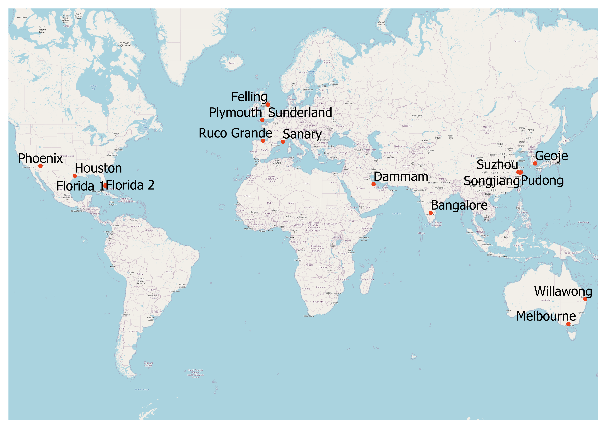
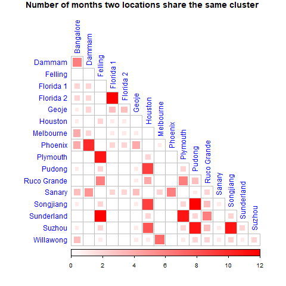
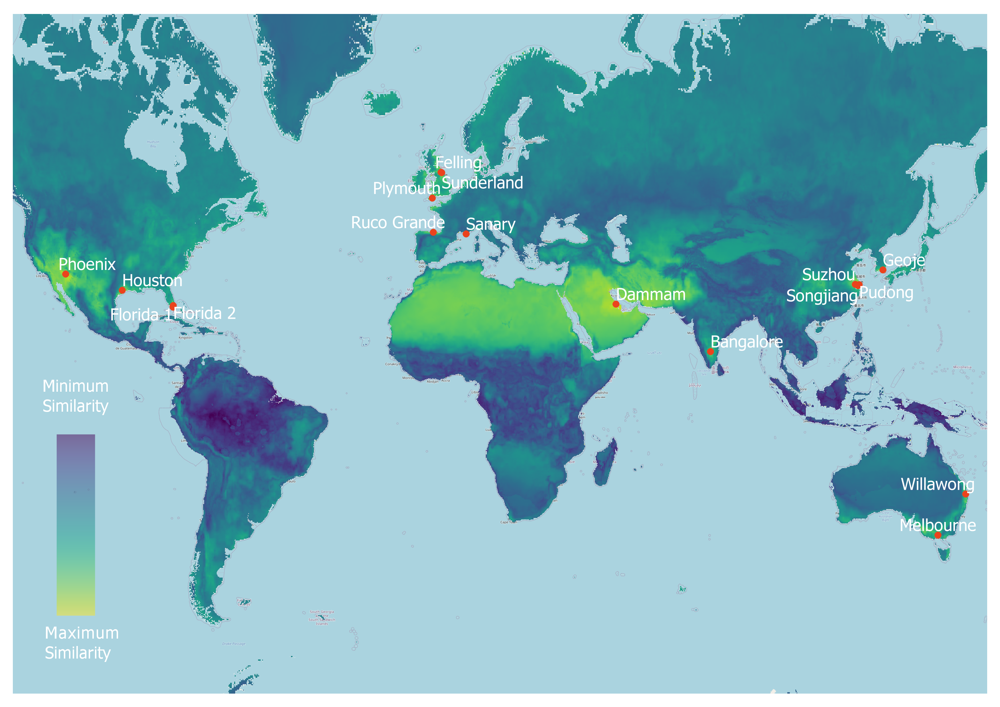
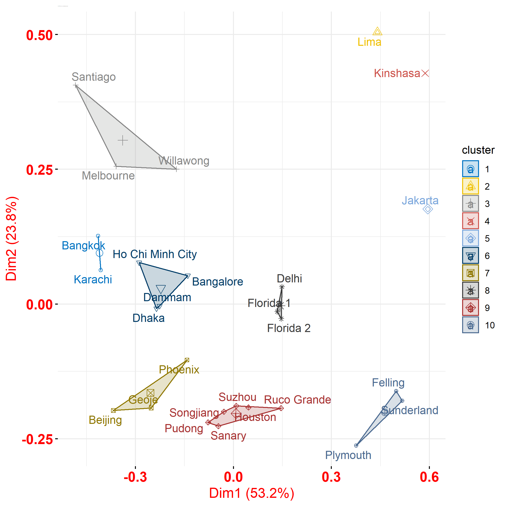
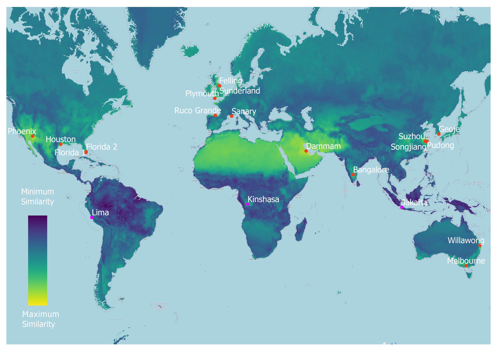

```{r setup, include=FALSE}
knitr::opts_chunk$set(echo = FALSE)
```

# Introduction

In order to better understand the resistance of a coating to the atmospheric environment coatings com-panies use "exposure testing site"s (ETSs) where coated substrates are left exposed to the atmosphere and then performance is assessed. AkzoNobel has many of these test sites around the world 

```{r, echo=FALSE, out.width="60%", fig.cap="Global Exposure testing sites of AkzoNobel", fig.align="center"}

```


The aim of these test sites it to be representative of the in service environments that AkzoNobel’s industrial coatings are exposed to. With the rise of readily available global climate data and the development of data science techniques to analyse this data an opportunity to carry out an investigation of the environments of the ETS and how well they represent global in-service environments has arisen.

## Objectives

1. Build a relevant climate data set. 
2. Compare the climate of exposure test sites to each other
3. Compare climate of exposure test sites to global climates documents
4.  Suggest locations for new ETSs that would improve global climate coverage of ETSs

# Methods

Both Hierarchical clustering(HC) and Partition Around Meidiods(PAM) were utilised to compare ETS to each other based on a data set consisting of temperature, precipitation, concentration of electrolyte, frequency of wetness and time of wetness. This cluster analysis was carried out for each month of the year and the number of times two locations were clustered together across the year was used as a measure of how unique each ETS was.

To measure the global coverage of all ETSs the climate of each ETS was compared to every other cell in a global raster data set using Dynamic Time Warping (DTW). This created a global raster of similarity for each ETS, the maximum value for each cell from any one of these raster was then taken to create a map of maximum similarity.

Finally, the climate of the ten locations with the least similarity, whos population was also in the highest quartile, were compared to the climate of already existing ETS using the same method stated above. Again, the number of times two locations were clustered together was used as a measure of uniqueness. The three suggested locations that were most unique compared to existing ETS were then taken and included in DTW analysis to measure the improvement in global climate coverage of including these additional ETS    

# Results

Figure \@ref(fig:match-matrix-ffp) shows the number of times two locations were clustered together across all 12 months. Siginificant overlap can be seen for Felling-Sunderland-Plymouth, Dammam-Phoenix, Houston-Pudong-Songjiang-Suzhou and Florida1-Florida-2. All other locations do not have significant overlap with another location this suggest they have unique climates when compared to other ETS.

```{r match-matrix-ffp, echo=FALSE, out.width="60%", fig.cap="Number of times two ETS share the same cluster", fig.align="center"}

```

Figure \@ref(fig:max-dtw-ffp) shows the maximum similarity across the globe when compared to ETS climates. Clearly visible in this are areas of low similarity in South America, West Africa and South East Asia.

```{r max-dtw-ffp, echo=FALSE, out.width="60%", fig.cap="Heatmap of maximum similarity value when compared to any Exposure testing site", fig.align="center"}

```

Figure \@ref(fig:dec-cluster-new) shows the PAM cluster including new locations for December. This is visualised as a plot of the first two principle component values. Clearly visible is the separation of Lima, Kinshasa and Jakarta from the rest of the data set. This is only a visualisation month but this highlights a consistent theme throughout the year. 

```{r dec-cluster-new, echo=FALSE, out.width="60%", fig.cap="PAM clustering of ETS including additional locations", fig.align="center"}

```

These three locations were selected to be included in a repeat comparison of ETS to the globe to measure the improvement. The heatmap of this comparison is shown in Figure \@ref(fig:max-dtw-new). Unfortunately the inclusion of these locations has not had a significant impact on improving the global coverage of AKzoNobel ETSs. These additional locations are distinct from existing ETS but likely also have unique climates on a global scale.  

```{r max-dtw-new, echo=FALSE, out.width="60%", fig.cap="Heatmap of maximum similarity value when compared to any Exposure testing site including additional locations", fig.align="center"}

```


# Next Steps

in order to build upon the work conducted in this report the optimum number of ETS could be suggested by measuring the impact each individual location has on the overall global similarity.The first locations to remove from the analysis would be one of Felling orSunderland, one of the two Florida locations, one of Phoenix or Dammam, Houston, Suzhou and Pudong and Willawong. This is because these locations are identified as having overlapping climate swith at least one other existing ETS. 

Another important area of future work should be in developing a method of identifying additionallocations that will have significant improvement on the global climate coverage. This method should factor in identifying climates that are distinct from existing ETS but that are also similar to the mostareas that currently have low similarity value. One method of achieving this could be to cluster a number of global locations that currently have low similarity values. After this clustering is complete the location that is closest to the centre of each cluster could be selected as a paragon of that cluster. The paragons of each cluster could then be included to measure the improvement in overall similarity.

Lastly, the results detailed in this analysis are intended as a guideline for consolidating exposure testing and also identifying areas that exposure testing could provide better coverage of global climates. In order to have full confidence in the results real world exposure testing will need to be carried out to validate the suggestions made in this report.

# Conclusion

A robust and objective comparison of existing ETSs on a monthly basis has been achieved in this analysis. The analysis clearly identifies locations that are not significantly different and locations whos climates are unique compared to other ETSs. 

Maximum DTW similarity has been implemented as an effective method for comparing ETS climates to climates around the globe. This has successfully identified areas of high similarity to current ETS and areas that are not covered by existing ETS. Unfortunately, the additional ETS suggested in this report have not caused a significant improvement in global similarity. However, valuable understanding has been gained in the shortcomings of the method outlined in this report and an effective next step has been identified to provide an improved solution. 

# References
